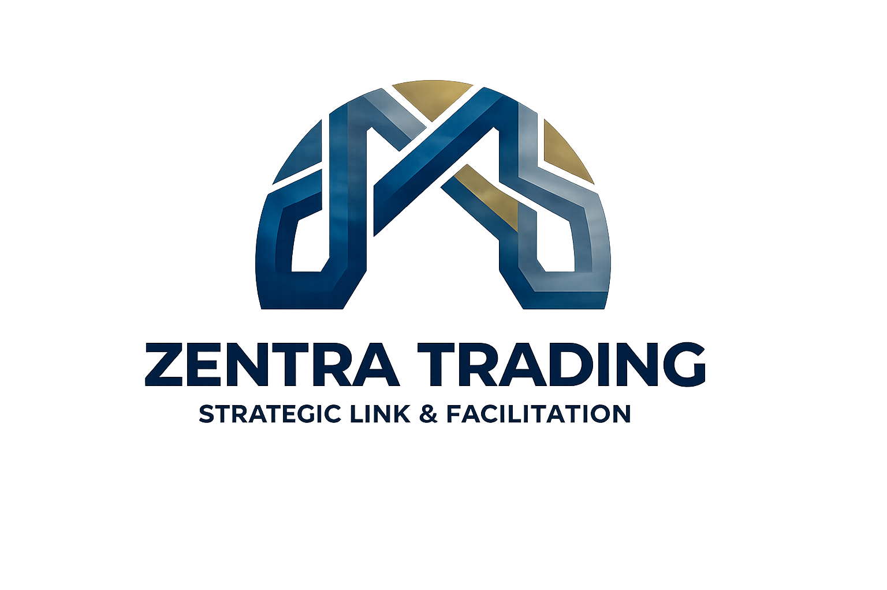

<p align="center">
  
</p>

<h1 align="center">Zentra Connect — Veloz</h1>

<p align="center">
  <strong>Global Commodity Trading Made Simple</strong>
</p>

<p align="center">
  Plataforma corporativa de intermediação de commodities que conecta produtores, fornecedores, exportadores, importadores e investidores através de soluções seguras e eficientes de trading global.
</p>

<p align="center">
  <a href="#-tecnologias">Tecnologias</a> •
  <a href="#-rotas">Rotas</a> •
  <a href="#-começar">Começar</a> •
  <a href="#-deploy">Deploy</a>
</p>

---

## 🚀 Tecnologias

| Camada | Tecnologia |
|--------|-----------|
| **Framework** | TanStack Start (Nitro + Vite + TanStack Router) |
| **Linguagem** | TypeScript + React 19 |
| **UI** | Tailwind CSS v4 + shadcn/ui (New York) |
| **i18n** | Custom (Inglês + Português) |
| **Autenticação** | Firebase Auth |
| **Runtime** | Node.js (SSR) |
| **Deploy** | Vercel (Nitro preset) |
| **Package Manager** | Bun |

## 📍 Rotas

| Rota | Página |
|------|--------|
| `/` | Home (hero, registo, dashboard, mapa-mundo, CTA) |
| `/about` | Sobre (missão, visão, valores) |
| `/commodities` | Commodities (agrícolas, minerais, energia, industriais) |
| `/how-it-works` | Como Funciona (passos + serviços) |
| `/insights` | Análises de Mercado / Blog |
| `/opportunities` | Marketplace de Oportunidades |
| `/partnership` | Parcerias (tiers) |
| `/contact` | Contacto (formulário + mapa) |
| `/login` | Autenticação |
| `/register` | Registo |
| `/dashboard` | Painel do utilizador |
| `/admin` | Administração |

## 🛠 Começar

```bash
# Instalar dependências
bun install

# Iniciar servidor de desenvolvimento
bun run dev

# Build de produção
bun run build

# Preview do build
bun run preview
```

## 🌐 Deploy

O projecto está configurado para deploy na **Vercel** através do preset Nitro `vercel`.

---

<p align="center">
  © 2026 <strong>Zentra Trading</strong>. Todos os direitos reservados.
</p>
